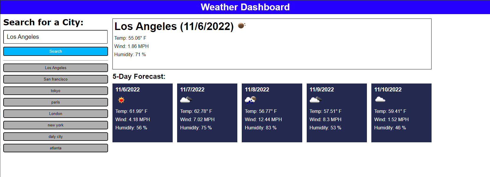

# weather-forecast-app

## Description

The purpose of this project was to further familerize myself with server side apis, and to create an application that delivers the current weather conditions as well as a five day forecast for any valid city that the user types into the search bar. This app allows user to plan their weeks or weekends according to the weather forecasts. A big part of the motivation to make this application is to gain a btter understanding of server side apis, and to learn how useful APIs are to developers and users. Not only did I learn how to fetch information from server APIs, but I learned how to retrieve that information and present it to the user in a clear and simple visual aesthetic. 

## Installation

No installation is required to view this password generator. Here is a link to the deployed website:
https://seanbl.github.io/weather-forecast-app/

## Usage

The following image shows the web application's appearance and functionality:

This webpage displays a layout for the user to input a city name which will then return current weather condtions for the city entered by the user. The conditions include not only the weather forecast, but also the temperature in fahrenheit, the wind speed in MPH, and the humidity in percent. A five day weather forecast for that city is also provided. The user's search history will be displayed underneath the search bar. The user can click on any city name in the search history, and the user will see the appropriate current weather conditions along with a five-day forecast. 

**Note**: This layout was intended for desktop viewing. The images may not display properly on smartphones or tablets. 

## Credits

N/A

## License

N/A